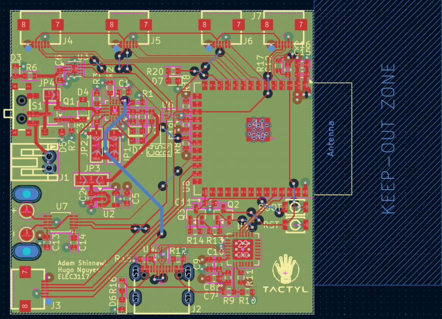

# Tactyl

Tactyl is a gesture-based typing interface that lets you type anywhere without a keyboard. It converts finger taps into digital characters, avoiding the fixed workspace and repetitive wrist/hand positioning that conventional keyboards require.

## Photos

 
.jpg)

## How It Works

Tactyl uses a **five-bit chorded input** scheme: each of the five fingers acts as one bit. Tapping different finger combinations produces unique 5-bit codes, which are mapped in software to characters and commands. This gives 32 possible combinations enough to cover the full alphabet.

Finger movement is tracked by five IMUs (one per finger) embedded in the glove, allowing the system to distinguish intentional taps from general hand motion. Sensor data is processed by an ESP32-based embedded controller and transmitted wirelessly to a host computer. A haptic feedback system provides confirmation of typed characters and connection status.

## System Architecture

**Sensing layer.** Five **IMUs**, one per finger, each measuring acceleration to detect individual finger taps independently. Since they all share the same I²C address, a **TCA9548A I²C multiplexer** separates them into independent channels to faciliate communication.

**Power.** A **BQ24074 linear charge management IC** handles Li-ion battery charging while supporting system load via its **power-path output**. Charge current (300mA/500 mA) is selectable via solder jumpers. **Reverse polarity protection** is implemented with a P-FET with a **G-S protection diode**. The 3.3 V rail is generated by a **AP2112 LDO**. A **MAX17048 fuel gauge** monitors voltage/SOC over I²C and asserts an ALERT interrupt for **low-battery detection**, feeding the firmware's haptic alert logic. Main power traces were sized appropriate to handle the expected load. 

**Programming.** A **CP2102 USB-UART bridge** converts USB differential signals to UART to program the ESP32. Differential traces are kept short and **sized to 90Ω impedance**. ESD protection diodes are placed as close to the USB-C connector as possible.

**Processing.** An **ESP32-S3 microcontroller** processes sensor inputs, runs tap detection, maintains the five-bit finger state register, performs chord recognition, and manages communication with the host device. Each completed chord is looked up in a table and converted into the corresponding character. An **auto-program circuit** is also implemented with a pair to MOSFETs to automatically trigger BOOT & RST when programming.

**Wireless communication.** The interpreted character is transmitted over **Bluetooth Low Energy (BLE)** from the ESP32-S3 to the host device. The antenna keep-out section is kept clear of any copper.

**Haptic feedback.** A vibration motor, driven by a **DRV2605L haptic driver**, gives the user tactile confirmation of events such as BLE connection/disconnection state and low power. An **ERM coin vibration motor** is mounted through **strain-relief holes** on the main PCB. For the next version, a better decoupling capacitor should be added to prevent the ESP from resetting during strong motor vibrations.

