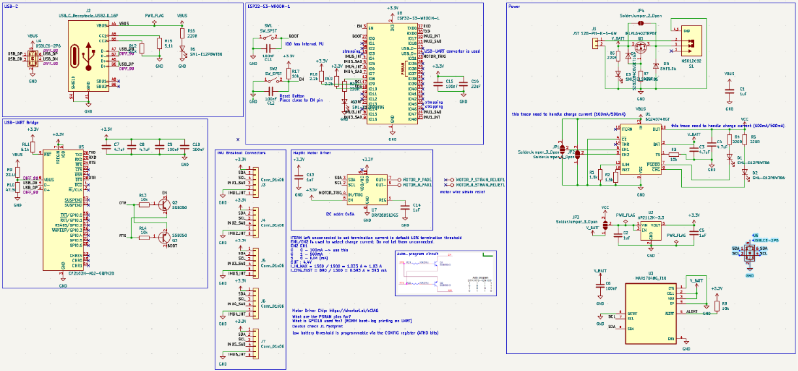
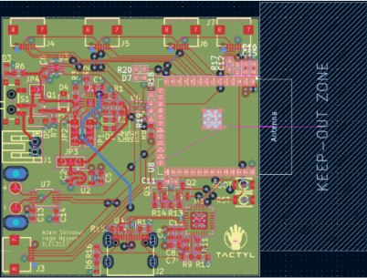
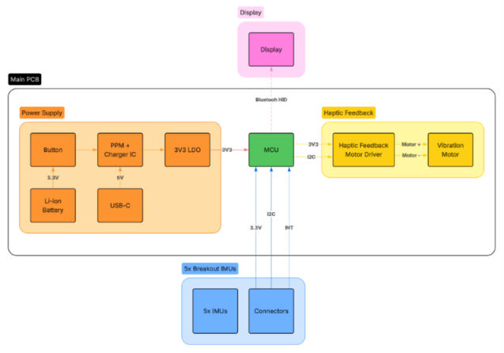

# Tactyl

Tactyl is a gesture-based typing interface that lets you type anywhere without a keyboard. It converts finger taps into digital characters, avoiding the fixed workspace and repetitive wrist/hand positioning that conventional keyboards require.

## Photos

.jpg)

## How It Works

Tactyl uses a **five-bit chorded input** scheme: each of the five fingers acts as one bit. Tapping different finger combinations produces unique 5-bit codes, which are mapped in software to characters and commands. This gives 32 possible combinations enough to cover the full alphabet.

Finger movement is tracked by five IMUs (one per finger) embedded in the glove, allowing the system to distinguish intentional taps from general hand motion. Sensor data is processed by an ESP32-based embedded controller and transmitted wirelessly to a host computer. A haptic feedback system provides confirmation of typed characters and connection status.

## Development Approach

The prototype was built incrementally:

1. Validate single-IMU sensing and tap detection from acceleration data.
2. Expand to all five fingers, managing multi-sensor I²C communication (all IMUs share the same limited address space, requiring a multiplexed bus while keeping wiring simple).
3. Develop firmware to pack finger states into a 5-bit register, decode chords, and map them to keyboard input.

## System Architecture

Tactyl consists of **four main subsystems** that work together to detect finger motion, identify deliberate taps, encode the recognized combination as a five-bit chord, convert the chord into a predefined character/command, and transmit the input wirelessly to a host device.

**Sensing layer.** Five IMUs are distributed across the glove, one per finger, each measuring acceleration to detect individual finger taps independently. Since all five IMUs share the same I²C address, the sensor network is interfaced to the microcontroller through a TCA9548A I²C multiplexer, which separates them into independent channels while retaining a common SDA/SCL bus.

**Processing.** An ESP32-S3 microcontroller processes sensor inputs, runs tap detection, maintains the five-bit finger state register, performs chord recognition, and manages communication with the host device. Each completed chord is looked up in a table and converted into the corresponding character.

**Wireless communication.** The interpreted character is transmitted over Bluetooth Low Energy (BLE) from the ESP32-S3 to the host device, letting Tactyl function as a wireless keyboard with no cable connection required.

**Haptic feedback.** A vibration motor, driven by a DRV2605L haptic driver, gives the user tactile confirmation of events such as successful chord entry or BLE connection/disconnection state.

All subsystems share a common power architecture supplying the microcontroller, sensing, and feedback stages from a single regulated rail.

